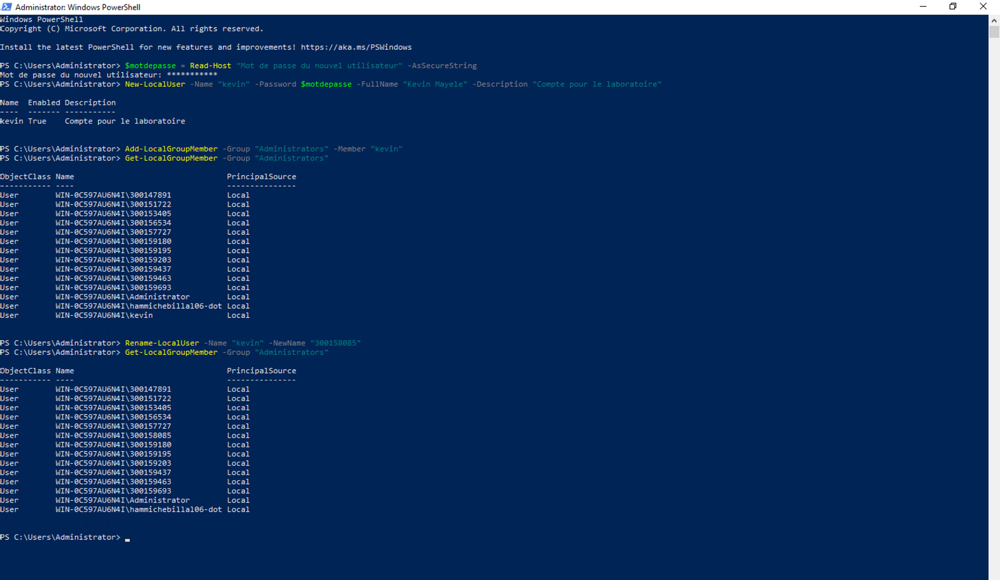

## Création d’un utilisateur administrateur avec PowerShell

**Nom :** Kevin Mayele  
**Numéro étudiant :** 300158085  
**Système :** Windows Server 2022 Datacenter

### Objectif

Créer un utilisateur ayant les droits d’administration sur Windows Server 2022 avec PowerShell et documenter la solution.

### 1. Connexion au serveur

Depuis mon Mac, j’ai utilisé Windows App pour me connecter au serveur `10.7.237.7` avec le compte Administrator.

J’ai vérifié que le serveur appartenait au groupe de travail `WORKGROUP`, puis ouvert Windows PowerShell en tant qu’administrateur.

### 2. Création de l’utilisateur

J’ai saisi le mot de passe du nouveau compte avec la commande suivante. La saisie du mot de passe était masquée.

```powershell
$motdepasse = Read-Host "Mot de passe du nouvel utilisateur" -AsSecureString
```

J’ai ensuite créé le compte local :

```powershell
New-LocalUser -Name "kevin" -Password $motdepasse -FullName "Kevin Mayele" -Description "Compte pour le laboratoire"
```

Le résultat affichait `True` dans la colonne `Enabled`, confirmant que le compte était activé.

### 3. Attribution des droits administrateur

J’ai ajouté l’utilisateur au groupe Administrators :

```powershell
Add-LocalGroupMember -Group "Administrators" -Member "kevin"
```

J’ai ensuite vérifié les membres du groupe :

```powershell
Get-LocalGroupMember -Group "Administrators"
```

Le compte `kevin` apparaissait dans la liste.

### 4. Difficulté rencontrée et correction

J’avais d’abord utilisé mon prénom comme nom de compte. En consultant la liste des administrateurs, j’ai remarqué que la plupart des autres comptes utilisaient un numéro étudiant.

J’ai donc renommé mon compte avec mon matricule :

```powershell
Rename-LocalUser -Name "kevin" -NewName "300158085"
```

### 5. Vérification finale

Après le renommage, j’ai vérifié à nouveau les membres du groupe Administrators :

```powershell
Get-LocalGroupMember -Group "Administrators"
```

Le compte `WIN-0C597AU6N4I\300158085` apparaît dans la liste. Le renommage a donc réussi et le compte a conservé ses droits administrateur.

### Capture du travail réalisé



### Conclusion

J’ai créé un utilisateur local avec PowerShell, attribué les droits administrateur et vérifié son appartenance au groupe Administrators. Le compte porte maintenant mon numéro étudiant, `300158085`.
