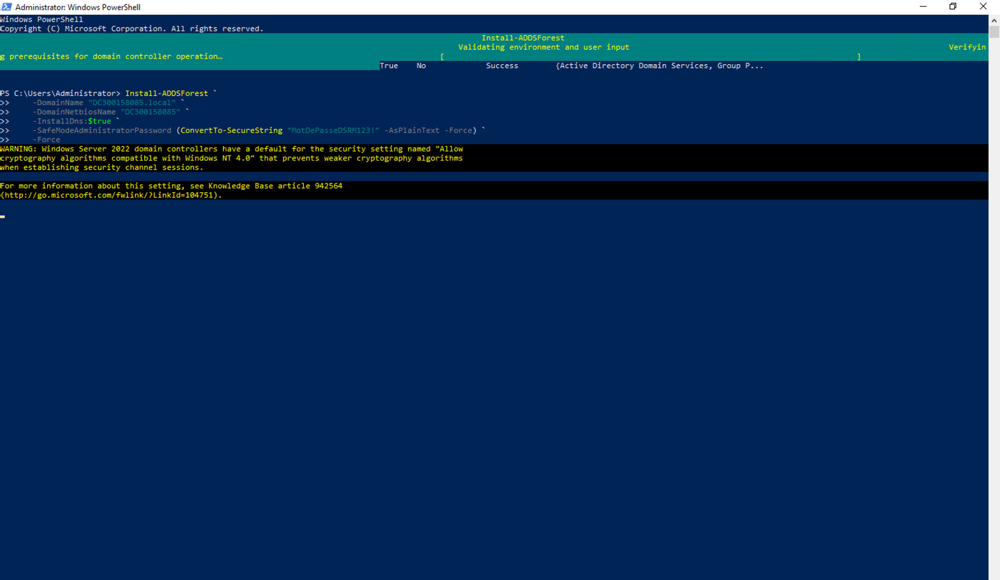
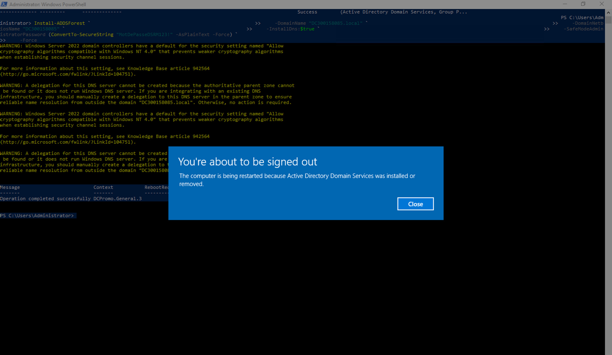
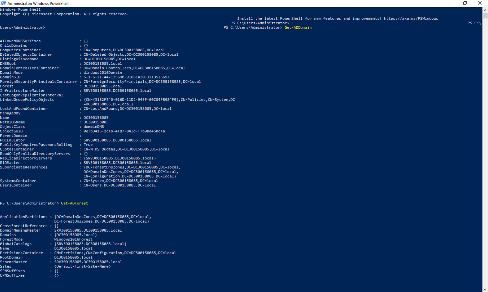

## Installation et configuration d’Active Directory

**Nom :** Kevin Mayele  
**Numéro étudiant :** 300158085  
**Système :** Windows Server 2022 Datacenter

### Objectif

Installer et configurer un contrôleur de domaine Active Directory avec PowerShell, en suivant les étapes du laboratoire.

### 1. Renommage du serveur

Depuis mon Mac, j’ai utilisé Windows App pour me connecter au serveur `10.7.237.219`.

J’ai ouvert PowerShell en tant qu’administrateur et renommé le serveur :

```powershell
Rename-Computer -NewName "SRV300158085" -Restart
```

Le serveur a redémarré, puis je me suis reconnecté.

### 2. Installation du rôle AD DS

J’ai installé Active Directory Domain Services et les outils de gestion :

```powershell
Install-WindowsFeature AD-Domain-Services -IncludeManagementTools
```

Le résultat affichait `Success : True`, `Restart Needed : No` et `Exit Code : Success`.

### 3. Création du domaine et de la forêt

J’ai utilisé la commande `Install-ADDSForest` du laboratoire avec les paramètres suivants :

- Domaine : `DC300158085.local`.
- Nom NetBIOS : `DC300158085`.
- Installation de DNS : `-InstallDns:$true`.
- Mot de passe DSRM renseigné selon l’exemple du laboratoire.
- Paramètre `-Force`.

Le mot de passe DSRM sert à accéder au mode de restauration d’Active Directory.



L’opération a affiché `Operation completed successfully`. Le serveur a ensuite redémarré automatiquement.



### 4. Vérification de l’installation

Après le redémarrage, je me suis reconnecté avec le compte `DC300158085\Administrator`.

J’ai exécuté les deux commandes de vérification demandées :

```powershell
Get-ADDomain
Get-ADForest
```

Les résultats confirment les informations suivantes :

| Élément | Valeur |
| --- | --- |
| Serveur | SRV300158085 |
| Domaine | DC300158085.local |
| Nom NetBIOS | DC300158085 |
| Forêt | DC300158085.local |
| Catalogue global | SRV300158085.DC300158085.local |



### Difficultés rencontrées

Au début, j’ai saisi le mot de passe de connexion directement dans PowerShell. Une erreur indiquait qu’il ne s’agissait pas d’une commande. J’ai compris que ce mot de passe devait être utilisé à la connexion.

J’étais aussi resté connecté au serveur du devoir précédent. J’ai ensuite ouvert une connexion vers mon serveur `10.7.237.219` avant de commencer les étapes du laboratoire.

Pendant la création de la forêt, des avertissements concernant la cryptographie et la délégation DNS sont apparus. L’opération a toutefois terminé avec le message `Operation completed successfully`. Les commandes de vérification ont ensuite renvoyé les informations du domaine et de la forêt.

### Résultat

J’ai réalisé les quatre étapes demandées : renommer le serveur, installer AD DS, créer une nouvelle forêt avec DNS et vérifier l’installation avec PowerShell.
