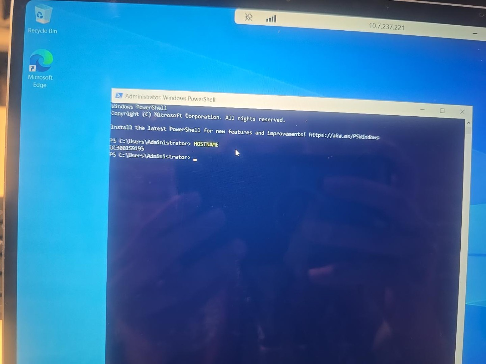
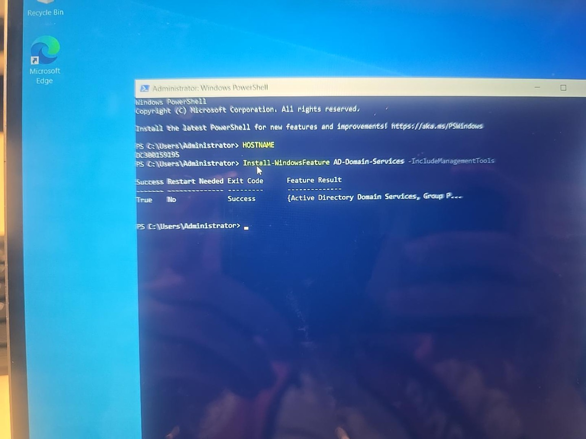
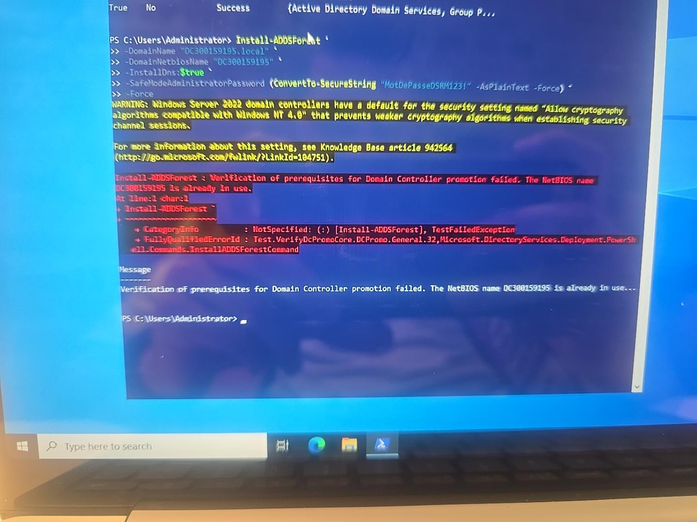
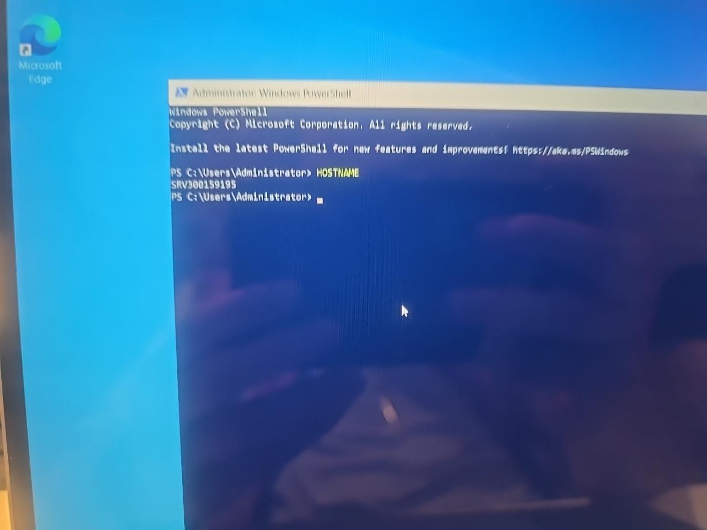
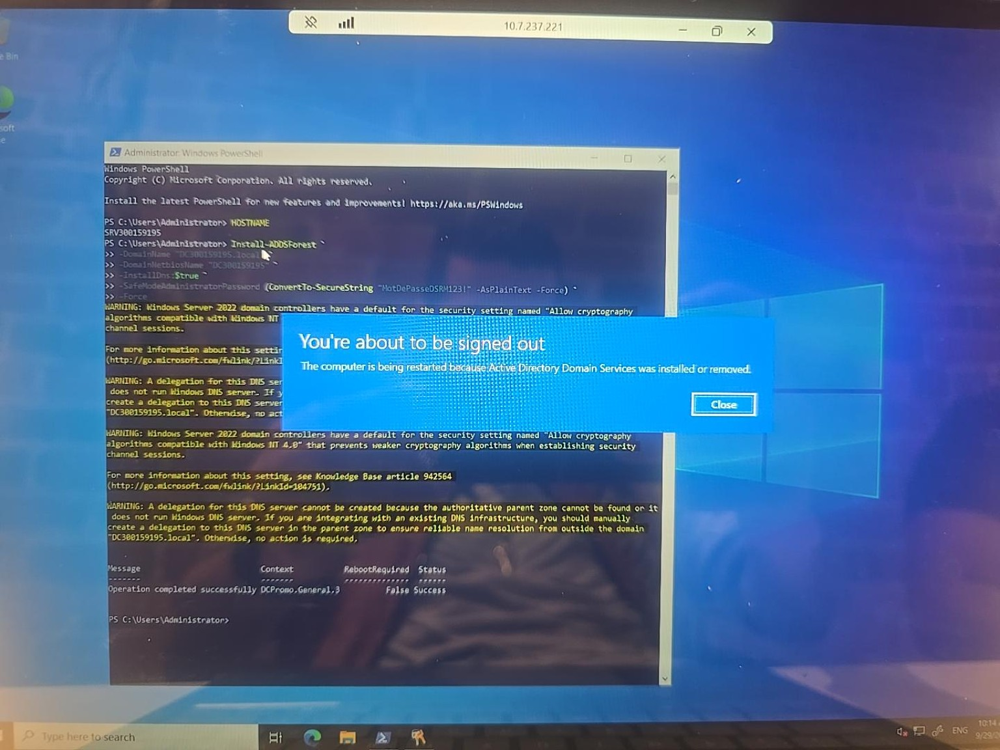
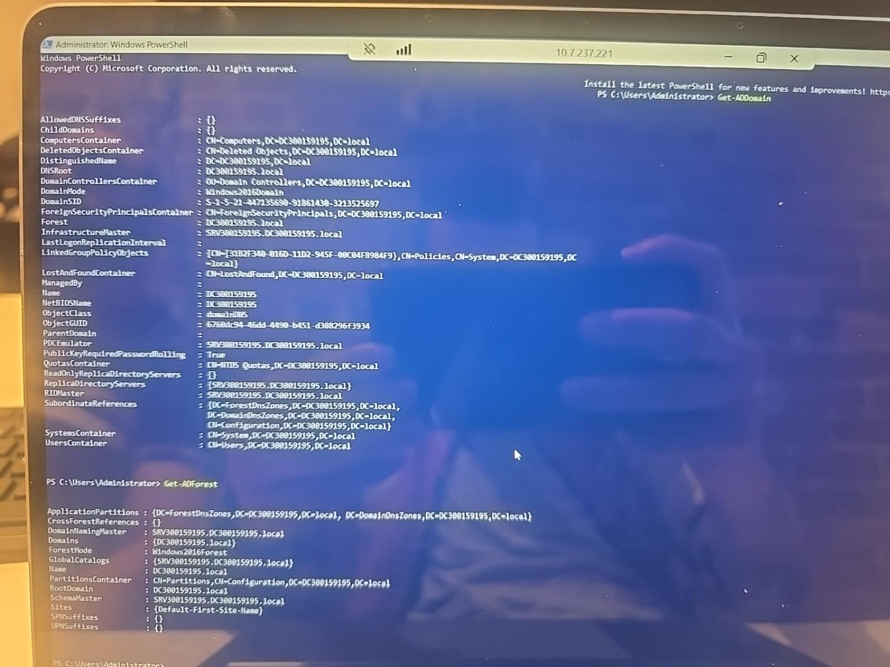
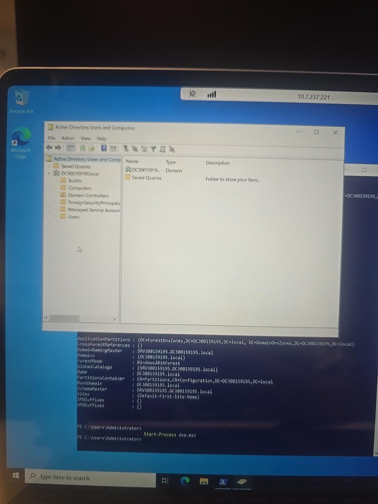
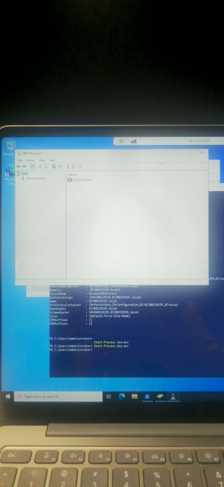

# Laboratoire 3 - Installation et configuration d’un domaine Active Directory

**Nom :** Touadjni Islem  
**ID :** 300159195  

## Objectif

Installer et configurer **Active Directory Domain Services (AD DS)** sur Windows Server 2022 à l’aide de PowerShell, créer un nouveau domaine avec DNS intégré, puis vérifier le fonctionnement du domaine et de la forêt.

---

## 1. Renommer le serveur

La première étape consiste à renommer le serveur avec l’identifiant étudiant.

```powershell
Rename-Computer -NewName "DC300159195" -Restart
```

Après le redémarrage, la commande suivante a été utilisée pour vérifier le nom de la machine :

```powershell
hostname
```

Résultat obtenu : `DC300159195`.



**Résultat :** le serveur a bien été renommé en `DC300159195`.

---

## 2. Installer le rôle Active Directory Domain Services

Le rôle **AD DS** et les outils de gestion ont été installés avec la commande suivante :

```powershell
Install-WindowsFeature AD-Domain-Services -IncludeManagementTools
```



**Résultat :** l’installation s’est terminée avec `Success : True`.

---

## 3. Première tentative de création du domaine

La création de la forêt a d’abord été lancée avec :

```powershell
Install-ADDSForest `
-DomainName "DC300159195.local" `
-DomainNetbiosName "DC300159195" `
-InstallDns:$true `
-SafeModeAdministratorPassword (ConvertTo-SecureString "MotDePasseDSRM123!" -AsPlainText -Force) `
-Force
```

La vérification des prérequis a retourné l’erreur suivante :

```text
The NetBIOS name DC300159195 is already in use.
```



**Explication :** le nom de la machine et le nom NetBIOS du domaine étaient identiques. Windows Server a donc détecté un conflit.

---

## 4. Corriger le conflit NetBIOS

Pour conserver `DC300159195` comme nom NetBIOS du domaine, le serveur a été renommé :

```powershell
Rename-Computer -NewName "SRV300159195" -Restart
```

Après le redémarrage, la commande suivante a été exécutée :

```powershell
hostname
```



**Résultat :** le nom de la machine est maintenant `SRV300159195`.

La configuration utilisée devient donc :

- **Serveur :** `SRV300159195`
- **Domaine DNS :** `DC300159195.local`
- **Nom NetBIOS :** `DC300159195`

---

## 5. Créer la forêt et le domaine Active Directory

La commande de création de la forêt a ensuite été exécutée de nouveau :

```powershell
Install-ADDSForest `
-DomainName "DC300159195.local" `
-DomainNetbiosName "DC300159195" `
-InstallDns:$true `
-SafeModeAdministratorPassword (ConvertTo-SecureString "MotDePasseDSRM123!" -AsPlainText -Force) `
-Force
```

Cette commande :

- crée une nouvelle forêt Active Directory ;
- crée le domaine `DC300159195.local` ;
- installe et configure DNS ;
- configure le mot de passe DSRM ;
- transforme le serveur en contrôleur de domaine.



**Résultat :** l’opération s’est terminée avec le statut `Success` et le serveur a redémarré automatiquement.

---

## 6. Connexion au domaine

Après le redémarrage, la connexion au serveur est effectuée avec le compte administrateur du nouveau domaine :

```text
DC300159195\Administrator
```

Le même mot de passe Administrator du serveur est utilisé pour la connexion normale au domaine.

> Le mot de passe DSRM configuré pendant l’installation est réservé au mode de restauration Active Directory.

---

## 7. Vérifier le domaine et la forêt

Après la connexion, les commandes suivantes ont été utilisées :

```powershell
Get-ADDomain
Get-ADForest
```



Les informations obtenues confirment notamment :

```text
Domaine     : DC300159195.local
Forêt       : DC300159195.local
Serveur DC  : SRV300159195.DC300159195.local
```

**Résultat :** le domaine et la forêt Active Directory sont correctement créés et fonctionnels.

---

## 8. Ouvrir Active Directory Users and Computers

La console **Active Directory Users and Computers** a été ouverte avec :

```powershell
Start-Process dsa.msc
```



La console affiche correctement le domaine :

```text
DC300159195.local
```

ainsi que les conteneurs Active Directory principaux, notamment :

- `Builtin`
- `Computers`
- `Domain Controllers`
- `ForeignSecurityPrincipals`
- `Managed Service Accounts`
- `Users`

---


## 9. Vérifier le service DNS

La console **DNS Manager** a été ouverte afin de vérifier que le service DNS a bien été installé avec Active Directory.

```powershell
dnsmgmt.msc
```



La console DNS affiche le serveur :

```text
SRV300159195
```

**Résultat :** le rôle DNS est installé et le serveur DNS est disponible sur le contrôleur de domaine.

---

## Résultat final

L’installation et la configuration d’Active Directory ont été réalisées avec succès.

Configuration finale :

```text
Nom du serveur       : SRV300159195
Domaine Active Directory : DC300159195.local
Nom NetBIOS          : DC300159195
DNS                  : Installé
Contrôleur de domaine: Fonctionnel
```

Les commandes `Get-ADDomain`, `Get-ADForest`, la console `dsa.msc` et la console DNS confirment que l’environnement Active Directory est opérationnel.
