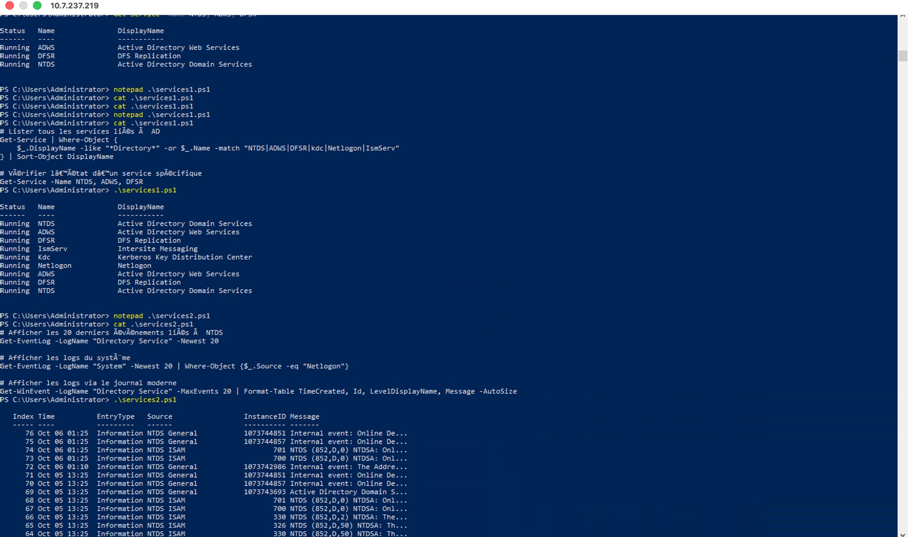
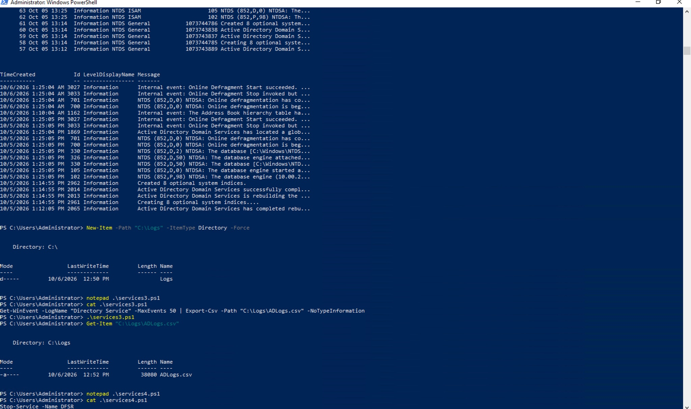
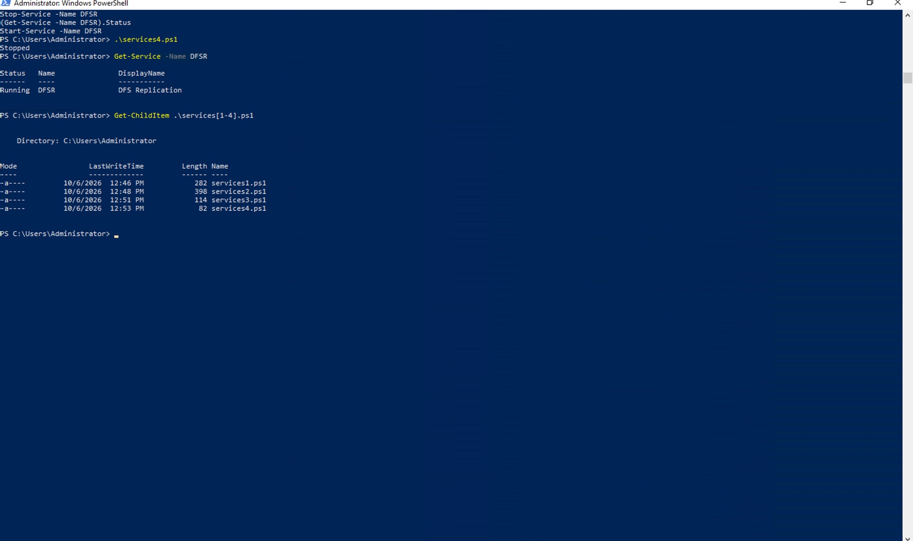
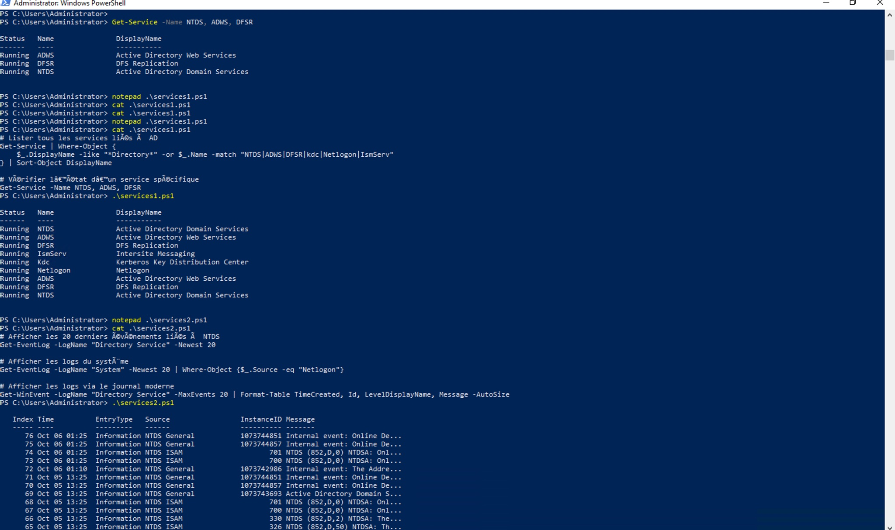

# Les services Windows et AD DS

**Nom :** Kevin Mayele  
**Numéro étudiant :** 300158085  
**Environnement :** Windows Server 2022, accessible depuis mon Mac.

## 1. Lister les services AD et leur état

J’ai créé le fichier `services1.ps1` avec Notepad. J’ai enregistré le script, vérifié son contenu avec `cat`, puis je l’ai exécuté dans PowerShell.

### Contenu de services1.ps1

```powershell
# Lister tous les services liés à AD
Get-Service | Where-Object {
    $_.DisplayName -like "*Directory*" -or $_.Name -match "NTDS|ADWS|DFSR|kdc|Netlogon|IsmServ"
} | Sort-Object DisplayName

# Vérifier l’état d’un service spécifique
Get-Service -Name NTDS, ADWS, DFSR
```

### Vérification et exécution

```powershell
cat .\services1.ps1
.\services1.ps1
```



Cette capture montre le contenu du script et son résultat. Les services NTDS, ADWS, DFSR, IsmServ, Kdc et Netlogon sont tous à l’état `Running`, ce qui signifie qu’ils sont en cours d’exécution.

ADWS, DFSR et NTDS apparaissent deux fois parce que le script contient une première commande pour lister les services AD et une deuxième pour vérifier ces trois services séparément. Le bas de la capture montre aussi le début de l’exécution de `services2.ps1`.

## 2. Afficher les événements d’un service AD

J’ai créé `services2.ps1` pour consulter les événements du journal `Directory Service` et rechercher les événements Netlogon parmi les 20 derniers événements du journal `System`.

### Contenu de services2.ps1

```powershell
# Afficher les 20 derniers événements liés à NTDS
Get-EventLog -LogName "Directory Service" -Newest 20

# Afficher les logs du système
Get-EventLog -LogName "System" -Newest 20 | Where-Object {$_.Source -eq "Netlogon"}

# Afficher les logs via le journal moderne
Get-WinEvent -LogName "Directory Service" -MaxEvents 20 | Format-Table TimeCreated, Id, LevelDisplayName, Message -AutoSize
```

### Vérification et exécution

```powershell
cat .\services2.ps1
.\services2.ps1
```

## 3. Capturer les événements dans un fichier CSV

Avant l’export, j’ai créé le dossier `C:\Logs` pour recevoir le fichier.

```powershell
New-Item -Path "C:\Logs" -ItemType Directory -Force
```

J’ai ensuite créé `services3.ps1` avec la commande demandée dans le laboratoire.

### Contenu de services3.ps1

```powershell
Get-WinEvent -LogName "Directory Service" -MaxEvents 50 | Export-Csv -Path "C:\Logs\ADLogs.csv" -NoTypeInformation
```

### Vérification et exécution

```powershell
cat .\services3.ps1
.\services3.ps1
Get-Item "C:\Logs\ADLogs.csv"
```



Le haut de cette capture montre le résultat de `services2.ps1`. Les événements affichés dans le journal `Directory Service` sont de niveau `Information`. La commande `Get-WinEvent` présente la date, l’identifiant, le niveau et le message de chaque événement.

Le filtre Netlogon n’a affiché aucun résultat parmi les 20 derniers événements du journal `System`.

La partie inférieure montre la création du dossier `C:\Logs`, le contenu de `services3.ps1` et son exécution. La vérification confirme que le fichier `ADLogs.csv` existe et possède une taille de 38 080 octets.

## 4. Arrêter et démarrer le service DFSR

J’ai créé `services4.ps1` pour arrêter DFSR, afficher son état après l’arrêt, puis le démarrer à nouveau.

### Contenu de services4.ps1

```powershell
Stop-Service -Name DFSR
(Get-Service -Name DFSR).Status
Start-Service -Name DFSR
```

### Vérification et exécution

```powershell
cat .\services4.ps1
.\services4.ps1
Get-Service -Name DFSR
```

J’ai aussi vérifié la présence des quatre scripts :

```powershell
Get-ChildItem .\services[1-4].ps1
```



Cette capture montre que le script affiche `Stopped` après l’arrêt de DFSR. Après la commande de démarrage, `Get-Service -Name DFSR` affiche `Running`. Le service est donc de nouveau en cours d’exécution.

La dernière commande confirme la présence de `services1.ps1`, `services2.ps1`, `services3.ps1` et `services4.ps1` dans `C:\Users\Administrator`.

## 5. Capture complémentaire



Cette capture montre la vérification initiale des services NTDS, ADWS et DFSR, tous à l’état `Running`. Elle montre également le contenu et l’exécution de `services1.ps1`, ainsi que les commandes de `services2.ps1` et le début des événements affichés.

Certains accents sont mal affichés dans les commentaires des scripts. Cela n’a pas empêché l’exécution des commandes.

## Résultats du laboratoire

| Objectif | Résultat |
|---|---|
| Lister les services AD et leur état | Les six services affichés sont à l’état `Running`. |
| Afficher les événements d’un service AD | Les événements de `Directory Service` ont été affichés. |
| Capturer les événements dans un fichier | Le fichier `C:\Logs\ADLogs.csv` a été créé. |
| Arrêter et démarrer un service | DFSR a été arrêté, puis démarré à nouveau. |
| Respecter le nom des scripts | Les quatre fichiers sont nommés `services1.ps1` à `services4.ps1`. |
